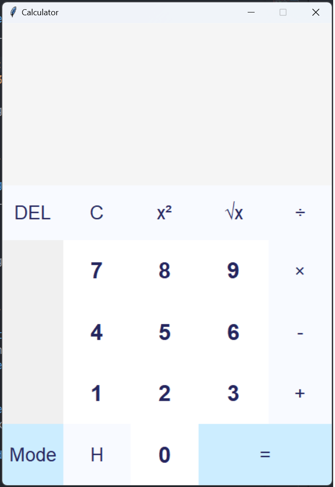
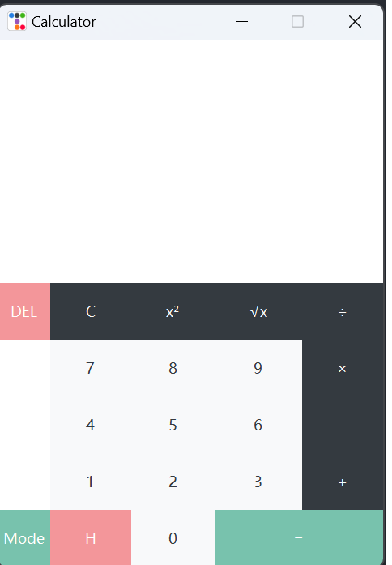

设计文档：多功能计算器

---

## 1. 概述

本项目旨在开发一个多功能计算器，支持基本计算、科学计算和编程计算模式。该计算器使用Python的Tkinter库进行图形用户界面（GUI）开发，并引入`math`和`fractions`模块以扩展计算功能。

## 2. 系统架构

### 2.1 模块划分

- **Calculator类**：主要的计算器逻辑和UI控制。
- **Tkinter库**：用于创建和管理图形用户界面。
- **math模块**：用于科学计算功能。
- **fractions模块**：用于处理分数计算。

### 2.2 类和方法

#### Calculator类

- `__init__(self)`: 初始化计算器窗口和UI组件。
- `bind_keys(self)`: 绑定键盘事件。
- `create_special_buttons(self)`: 创建特殊功能按钮（清除、等于、平方、开方、删除、历史记录）。
- `create_display_labels(self)`: 创建显示标签。
- `create_display_frame(self)`: 创建显示框架。
- `add_to_expression(self, value)`: 将值添加到当前表达式中。
- `create_digit_buttons(self)`: 创建数字按钮。
- `append_operator(self, operator)`: 添加操作符到表达式中。
- `create_operator_buttons(self)`: 创建操作符按钮。
- `clear(self)`: 清除当前和总表达式。
- `create_clear_button(self)`: 创建清除按钮。
- `square(self)`: 计算平方。
- `create_square_button(self)`: 创建平方按钮。
- `sqrt(self)`: 计算平方根。
- `create_sqrt_button(self)`: 创建平方根按钮。
- `evaluate(self)`: 评估表达式并显示结果。
- `create_equals_button(self)`: 创建等于按钮。
- `create_buttons_frame(self)`: 创建按钮框架。
- `update_total_label(self)`: 更新总表达式标签。
- `update_label(self)`: 更新当前表达式标签。
- `switch_mode(self)`: 切换计算器模式。
- `create_mode_switch_button(self)`: 创建模式切换按钮。
- `update_buttons(self)`: 更新按钮布局。
- `create_scientific_buttons(self)`: 创建科学计算按钮。
- `create_programmer_buttons(self)`: 创建编程计算按钮。
- `delete_last_char(self)`: 删除当前表达式的最后一个字符。
- `create_delete_button(self)`: 创建删除按钮。
- `show_history(self)`: 显示历史记录。
- `create_history_button(self)`: 创建历史记录按钮。
- `run(self)`: 启动计算器应用。

## 3. 用户界面设计

### 3.1 窗口和框架

- **主窗口**：大小为475x667（基本模式），不可调整大小，标题为“Calculator”。
- **显示框架**：用于显示当前和总表达式，背景色为浅灰色。
- **按钮框架**：用于放置所有按钮。

### 3.2 标签

- **总表达式标签**：显示总表达式，字体为Arial 16号，背景色浅灰色，前景色深蓝色。
- **当前表达式标签**：显示当前表达式，字体为Arial 40号，背景色浅灰色，前景色深蓝色。

### 3.3 按钮

- **数字按钮**：白色背景，深蓝色前景，Arial 24号字体。
- **操作符按钮**：浅白色背景，深蓝色前景，Arial 20号字体。
- **特殊功能按钮**：包括清除、等于、平方、开方、删除、历史记录按钮。
- **模式切换按钮**：用于切换基本、科学、编程模式。

### 3.4 布局

- **基本模式**：数字按钮、操作符按钮、清除、等于、平方、开方、删除、历史记录按钮。
- **科学模式**：额外的科学计算按钮（sin, cos, tan, asin, acos, atan, log, ln, exp, π）。
- **编程模式**：额外的编程计算按钮（AND, OR, XOR, NOT, LSH, RSH, BIN, HEX）。

## 4. 功能描述

### 4.1 基本功能

- **数字输入**：支持0-9和小数点。
- **基本操作**：加、减、乘、除。
- **表达式评估**：支持括号和多步计算。
- **清除功能**：清除当前和总表达式。
- **删除功能**：删除当前表达式的最后一个字符。
- **历史记录**：显示计算历史。

### 4.2 科学计算功能

- **三角函数**：sin, cos, tan, asin, acos, atan。
- **对数函数**：log, ln。
- **指数函数**：exp。
- **常数**：π。

### 4.3 编程计算功能

- **逻辑操作**：AND, OR, XOR, NOT。
- **移位操作**：LSH, RSH。
- **进制转换**：BIN, HEX。

## 5. 错误处理

- **表达式错误**：在评估表达式时捕获异常并显示“Error”。
- **历史记录为空**：当没有历史记录时，显示提示信息。

## 6. 运行说明

- 确保安装了Python和Tkinter库。
- 运行`Calculator`类的`run`方法启动应用程序。

```python
if __name__ == "__main__":
    calc = Calculator()
    calc.run()
```



## 改进

- 感觉UI太丑了，用了ttkbootstrap库进行优化。



```python
import tkinter as tk
import tkinter.messagebox as messagebox
import math
import fractions  # 添加这个模块来处理分数

# 导入 ttkbootstrap
import ttkbootstrap as ttk
from ttkbootstrap.constants import *

LARGE_FONT_STYLE = ("Arial", 40, "bold")
SMALL_FONT_STYLE = ("Arial", 16)
DIGITS_FONT_STYLE = ("Arial", 24, "bold")
DEFAULT_FONT_STYLE = ("Arial", 17)


class Calculator:
    def __init__(self):
        self.window = ttk.Window()  # 创建窗口
        style = ttk.Style()
        style.theme_use('minty')
        self.window.geometry("475x650")
        self.window.resizable(0, 0)
        self.window.title("Calculator")

        self.total_expression = ""
        self.current_expression = ""
        self.history = []  # 添加历史记录列表
        self.display_frame = self.create_display_frame()

        self.total_label, self.label = self.create_display_labels()

        self.mode = "basic"  # 初始模式
        self.digits = {
            7: (1, 1), 8: (1, 2), 9: (1, 3),
            4: (2, 1), 5: (2, 2), 6: (2, 3),
            1: (3, 1), 2: (3, 2), 3: (3, 3),
            0: (4, 2), '.': (4, 1)
        }
        self.operations = {"/": "\u00F7", "*": "\u00D7", "-": "-", "+": "+"}
        self.buttons_frame = self.create_buttons_frame()

        self.buttons_frame.rowconfigure(0, weight=1)
        for x in range(1, 5):
            self.buttons_frame.rowconfigure(x, weight=1)
            self.buttons_frame.columnconfigure(x, weight=1)
        self.create_digit_buttons()
        self.create_operator_buttons()
        self.create_special_buttons()
        self.create_mode_switch_button()  # 创建模式切换按钮
        self.bind_keys()

    def bind_keys(self):
        self.window.bind("<Return>", lambda event: self.evaluate())
        for key in self.digits:
            self.window.bind(str(key), lambda event, digit=key: self.add_to_expression(digit))

        for key in self.operations:
            self.window.bind(key, lambda event, operator=key: self.append_operator(operator))

    def create_special_buttons(self):
        self.create_clear_button()
        self.create_equals_button()
        self.create_square_button()
        self.create_sqrt_button()
        self.create_delete_button()  # 创建删除按钮
        self.create_history_button()  # 创建历史记录按钮

    def create_display_labels(self):
        total_label = tk.Label(self.display_frame, text=self.total_expression, anchor=tk.E, padx=24,
                               font=SMALL_FONT_STYLE)
        total_label.pack(expand=True, fill='both')

        label = tk.Label(self.display_frame, text=self.current_expression, anchor=tk.E, padx=24, font=LARGE_FONT_STYLE)
        label.pack(expand=True, fill='both')

        return total_label, label

    def create_display_frame(self):
        frame = tk.Frame(self.window, height=221)
        frame.pack(expand=True, fill="both")
        return frame

    def add_to_expression(self, value):
        if self.mode == "scientific" and value in ["sin", "cos", "tan", "asin", "acos", "atan"]:
            self.current_expression += f"math.{value}(math.radians("
        else:
            self.current_expression += str(value)
        self.update_label()

    def create_digit_buttons(self):
        for digit, grid_value in self.digits.items():
            button = ttk.Button(self.buttons_frame, text=str(digit), style="light.TButton",  # 使用 ttkbootstrap 的样式
                                command=lambda x=digit: self.add_to_expression(x))
            button.grid(row=grid_value[0], column=grid_value[1], sticky=tk.NSEW)

    def append_operator(self, operator):
        if self.current_expression.endswith('/'):
            self.current_expression += operator
        else:
            self.current_expression += operator
            self.total_expression += self.current_expression
            self.current_expression = ""
        self.update_total_label()
        self.update_label()

    def create_operator_buttons(self):
        i = 0
        for operator, symbol in self.operations.items():
            button = ttk.Button(self.buttons_frame, text=symbol, style="dark.TButton",  # 使用 ttkbootstrap 的样式
                                command=lambda x=operator: self.append_operator(x))
            button.grid(row=i, column=4, sticky=tk.NSEW)
            i += 1

    def clear(self):
        self.current_expression = ""
        self.total_expression = ""
        self.update_label()
        self.update_total_label()

    def create_clear_button(self):
        button = ttk.Button(self.buttons_frame, text="C", style="dark.TButton",  # 使用 ttkbootstrap 的样式
                            command=self.clear)
        button.grid(row=0, column=1, sticky=tk.NSEW)

    def square(self):
        self.current_expression = str(eval(f"{self.current_expression}**2"))
        self.update_label()

    def create_square_button(self):
        button = ttk.Button(self.buttons_frame, text="x\u00b2", style="dark.TButton", # 使用 ttkbootstrap 的样式
                            command=self.square)
        button.grid(row=0, column=2, sticky=tk.NSEW)

    def sqrt(self):
        self.current_expression = str(eval(f"{self.current_expression}**0.5"))
        self.update_label()

    def create_sqrt_button(self):
        button = ttk.Button(self.buttons_frame, text="\u221ax", style="dark.TButton",  # 使用 ttkbootstrap 的样式
                            command=self.sqrt)
        button.grid(row=0, column=3, sticky=tk.NSEW)

    def evaluate(self):
        self.total_expression += self.current_expression
        self.update_total_label()
        try:
            # 处理分数表达式
            if '/' in self.total_expression and not self.total_expression.startswith('math.'):
                self.current_expression = str(eval("fractions.Fraction(" + self.total_expression + ")"))
            else:
                self.current_expression = str(eval(self.total_expression))
            self.history.append(self.total_expression + " = " + self.current_expression)  # 保存到历史记录
            self.total_expression = ""
        except Exception as e:
            self.current_expression = "Error"
        finally:
            self.update_label()

    def create_equals_button(self):
        button = ttk.Button(self.buttons_frame, text="=",  # 使用 ttkbootstrap 的样式
                            command=self.evaluate)
        button.grid(row=4, column=3, columnspan=2, sticky=tk.NSEW)

    def create_buttons_frame(self):
        frame = tk.Frame(self.window)
        frame.pack(expand=True, fill="both")
        return frame

    def update_total_label(self):
        expression = self.total_expression
        for operator, symbol in self.operations.items():
            expression = expression.replace(operator, f' {symbol} ')
        self.total_label.config(text=expression)

    def update_label(self):
        self.label.config(text=self.current_expression[:11])

    def switch_mode(self):
        if self.mode == "basic":
            self.mode = "scientific"
            self.window.geometry("675x325")  # 调整窗口大小以适应科学模式下的按钮
        elif self.mode == "scientific":
            self.mode = "programmer"
            self.window.geometry("700x325")  # 调整窗口大小以适应编程模式下的按钮
        else:
            self.mode = "basic"
            self.window.geometry("475x650")  # 调整窗口大小以适应基本模式下的按钮
        self.update_buttons()

    def create_mode_switch_button(self):
        button = tk.Button(self.buttons_frame, text="Mode",
                           borderwidth=0, command=self.switch_mode)
        button.grid(row=4, column=0, sticky=tk.NSEW)

    def update_buttons(self):
        for widget in self.buttons_frame.winfo_children():
            widget.destroy()

        self.create_digit_buttons()
        self.create_operator_buttons()
        self.create_special_buttons()
        self.create_mode_switch_button()

        # 在所有模式下都添加清零和删除按钮
        self.create_clear_button()
        self.create_delete_button()

        if self.mode == "scientific":
            self.create_scientific_buttons()
            for i in range(6):  # 根据科学模式下的行数调整
                self.buttons_frame.rowconfigure(i, weight=1)
            self.buttons_frame.columnconfigure(5, weight=1)  # 添加额外的列配置
        elif self.mode == "programmer":
            self.create_programmer_buttons()
            for i in range(5):  # 根据编程模式下的行数调整
                self.buttons_frame.rowconfigure(i, weight=1)
            self.buttons_frame.columnconfigure(5, weight=1)  # 添加额外的列配置

    def create_scientific_buttons(self):
        scientific_buttons = {
            "sin": (0, 5), "cos": (1, 5), "tan": (2, 5), "asin": (3, 5),
            "acos": (4, 5), "atan": (0, 6), "log": (1, 6), "ln": (2, 6),
            "(": (3, 6), ")": (4, 6), "exp": (0, 7), "π": (1, 7)
        }
        for text, grid_value in scientific_buttons.items():
            button = ttk.Button(self.buttons_frame, text=text, style="dark.TButton",  # 使用 ttkbootstrap 的样式
                                command=lambda x=text: self.add_to_expression(
                                    f"math.{x}(" if x in ["sin", "cos", "tan", "asin", "acos", "atan", "log", "ln",
                                                          "exp"] else (str(math.pi) if x == "π" else x)))
            button.grid(row=grid_value[0], column=grid_value[1], sticky=tk.NSEW)

    def create_programmer_buttons(self):
        programmer_buttons = {
            "AND": (0, 5), "OR": (1, 5), "XOR": (2, 5), "NOT": (3, 5),
            "LSH": (4, 5), "RSH": (0, 6), "BIN": (1, 6), "HEX": (2, 6)
        }
        # 获取style
        style = ttk.Style()
        # 配置样式
        style.configure('programmer.TButton', font=("Arial", 12, "bold"))
        for text, grid_value in programmer_buttons.items():
            button = ttk.Button(self.buttons_frame, text=text, style="dark.TButton",
                                command=lambda x=text: self.add_to_expression(x))
            button.grid(row=grid_value[0], column=grid_value[1], sticky=tk.NSEW)

    def delete_last_char(self):
        self.current_expression = self.current_expression[:-1]
        self.update_label()

    def create_delete_button(self):
        button = ttk.Button(self.buttons_frame, text="DEL", style="secondary.TButton",  # 使用 ttkbootstrap 的样式
                            command=self.delete_last_char)
        button.grid(row=0, column=0, sticky=tk.NSEW)

    def show_history(self):
        if self.history:
            history_str = "\n".join(self.history)
            tk.messagebox.showinfo("History", history_str)
        else:
            tk.messagebox.showinfo("History", "No history yet.")

    def create_history_button(self):
        button = ttk.Button(self.buttons_frame, text="H", style="secondary.TButton",  # 使用 ttkbootstrap 的样式
                            command=self.show_history)
        button.grid(row=4, column=1, sticky=tk.NSEW)

    def run(self):
        self.window.mainloop()


if __name__ == "__main__":
    calc = Calculator()
    calc.run()
```